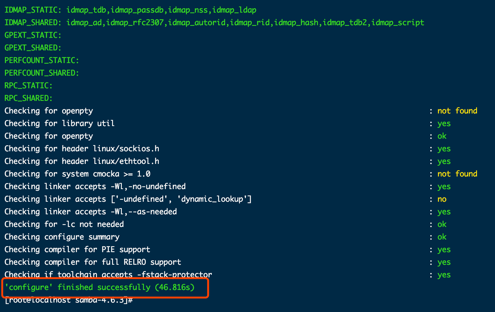
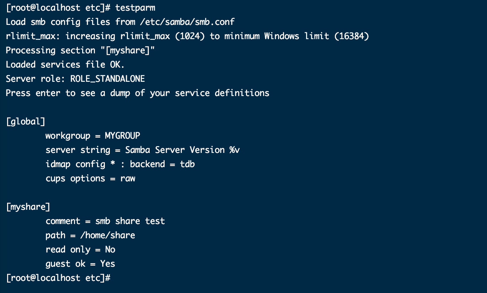

# CentOS 6.x安装samba4.6.3

### 下载地址：
`https://download.samba.org/pub/samba/stable/samba-4.6.3.tar.gz`

```angular2html
安装

$ yum install gcc gcc++ gnutls-devel python python-devel python-lib* libacl-devel openldap-devel -y
$ tar xf samba-4.6.3.tar.gz
$ cd samba-4.6.3
$ ./configure --prefix=/soft/samba
$ make && make install
```
 

 

### 添加动态链接库

```angular2html
$ echo "/soft/samba/lib" >> /etc/ld.so.conf
$ ldconfig #加载动态链接库
```

### 复制、过滤配置文件，可以省略自己生成
```angular2html
$ cp /root/samba-4.6.3/packaging/LSB/smb.conf /soft/samba/etc/
$ cd !$
$ cp smb.conf smb.conf.bak
$ grep -Ev "#|^$|;" smb.conf.bak > smb.conf
```
 
### 密码登陆，配置信息

```angular2html
$ vim smb.conf
[global]
        workgroup = MYGROUP
        server string = Samba Server Version %v
        security = user
        passdb backend = tdbsam
        load printers = yes
        cups options = raw
        map to guest = bad user
        max connections = 0
        log file = /var/log/samba/log.%m
        max log size = 1024
[data]
        comment=Temporary file space
        path=/data
        read only=no
        valid users = analogy
        write list = analogy
        printable = no
        create mask = 0755
        directory mask = 0755
        #public=yes
```


### 创建用户,
> 注：这里需要系统上已存在的用户，不然会报错
>
>$ useradd analogy

```angular2html
$ /soft/samba/bin/pdbedit -a -u analogy
输入密码即可完成配置
```

### 查看用户是否创建成功
```angular2html
$ /soft/samba/bin/pdbedit -L
analogy:500:
```
### Samba 远程命令执行漏洞（CVE-2017-7494）
> vim smb.conf
>
>cp smb.conf /etc/samba/
>
> testparm 
>
>service smb restart
>


```angular2html
[global]
    workgroup = MYGROUP
    server string = Samba Server Version %v
    security = user
    passdb backend = tdbsam
    load printers = yes
    cups options = raw

[myshare]
    comment=smb share test
    browseable=yes
    writeable=yes
    path=/home/share
    public = yes
    guest ok = yes
```
```
$ /soft/samba/sbin/smbd -D   #启动samba服务器
$ /soft/samba/sbin/nmbd -D
```
### 这里用官网的脚本来启动、关闭、重启samba服务

```angular2html
$ vim /etc/rc.d/init.d/smb
#!/bin/sh
# Check that the Samba configuration file exists
[ -f /soft/samba/etc/smb.conf ] || exit 0
start(  )
{
        echo -n "Starting SMB services: "
        /soft/samba/sbin/smbd -D
        ERROR=$?
        echo
        echo -n "Starting NMB services: "
        /soft/samba/sbin/nmbd -D
        ERROR2=$?
        if [ $ERROR2 -ne 0 ]
        then
                ERROR=1
        fi
        echo
        return $ERROR
}
stop(  )
{
        echo -n "Shutting down SMB services: "
        /bin/kill -TERM -a smbd
        ERROR=$?
        echo
        echo -n "Shutting down NMB services: "
        /bin/kill -TERM -a nmbd
        ERROR2=$?
        if [ $ERROR2 -ne 0 ]
        then
                ERROR=1
        fi
        echo
        return $ERROR
}
restart(  )
{
        stop
        sleep 2
        start
}
case "$1" in
  start)
        start
        ;;
  stop)
        stop
        ;;
  restart)
        restart
        ;;
  *)
        echo "Usage: $0 {start|stop|restart}"
        exit 1
esac
exit $?
```
### 记得给执行权限
```angular2html
$ chmod +x !$

$ service smb start    #开启
$ service smb stop     #关闭
$ service smb restart   #重启
```

### 注：关闭服务会有报如下错误，不影响使用，暂时忽略

```angular2html
$ service smb stop
Shutting down SMB services: 
kill smbd: No such process
kill smbd: No such process
Shutting down NMB services:
```


### selinux关闭
```
[root@localhost ~]# getenforce

Enforcing        //enforceing代表开启
Permissive      // permissive代表警告
Disabled       //disabled代表关闭
[root@localhost ~]#setenforce 0    //关闭
[root@localhost ~]#setenforce 1    //开启
```

###通过配置文件“/etc/sysconfig/selinux”来修改selinux状态，此种做法需要重启机器

> gedit /etc/sysconfig/selinux 
```
# This file controls the state of SELinux on the system.
# SELINUX= can take one of these three values:
#     enforcing - SELinux security policy is enforced.
#     permissive - SELinux prints warnings instead of enforcing.
#     disabled - No SELinux policy is loaded.
SELINUX=disabled
```

### 替换uid
```angular2html
sed -i 's/500/0/g' /etc/passwd

```
